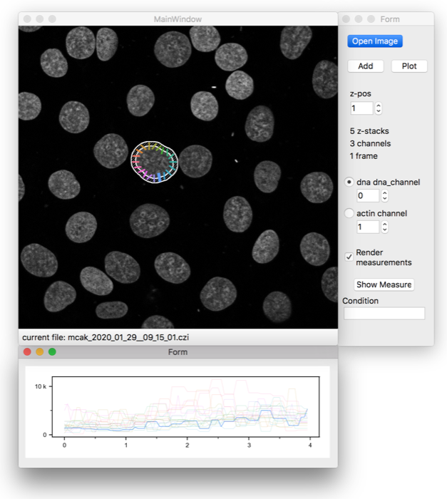
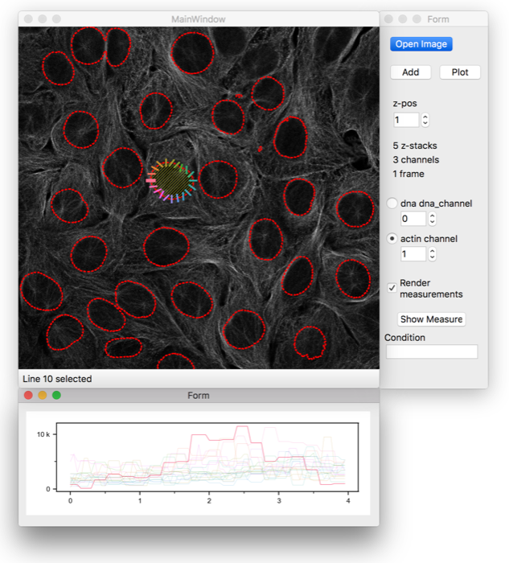

# Contour Intensity Measurements in Python
This tool helps to measure image intensity profiles around the perimeter of some geometrical structure. We used it in our paper to measure Actin perinuclear profiles on fluorescence microscopy.

If you use this software for academic purposes, please cite:

*Stiff T, Echegaray-Iturra F et al. (2020), Prophase-specific perinuclear actin coordinates centrosome separation and positioning to ensure accurate chromosome segregation, Cell Reports.*

## Table of contents
* [Screenshots](#screenshots)
* [Features](#features)
* [Status](#status)
* [Running from source](#running-from-source)
* [Contact](#contact)
* [Licence](#licence)

## Screenshots

## Features
List of features:
* Segment objects to extract their boundary, for further use in the measurement.
* Supports multi channel tiff anz czi (Zeiss) files.
* Option to select the line profile from either the image or the intensity plot.
* Rectification of the image stripe around the contour.
* Export to csv generation (powered by Pandas) of all registered measurements.

## Status
This project stems from the work I've done in my Ph.D. studies, exclusively for the purpose of the associated publication. Consequently is in a state of _feature freeze_. Work is primarily focused on bug fixing and improving user experience.

## Running from source
Download the source archive, then execute in the Terminal:

    pip3 install -r requirements.txt
    
You can then run the application with:

    python3 ring_tool.py
    
### Dependencies
Requires Python 3.6 or greater. There are also some packages that this library depends on. For specifics, see requirements.txt, but the main packages required are
* PyQt5 - version >=5.11.3
* Pandas - version >=0.23.4
* Scikit image - version >=0.14.2
* Shapely - version >=1.6.4.post2
* Matplotlib - version >=3.0.2
* Seaborn - version >=0.10.0

## Contact
Created by [@fabioechegaray](https://twitter.com/fabioechegaray)
* [f.echegaray-iturra@sussex.ac.uk](mailto:f.echegaray-iturra@sussex.ac.uk)

## License
Contour Intensity Measurements in Python

Copyright (C) 2020  The Hochegger Lab, Fabio Echegaray.

This program is free software: you can redistribute it and/or modify
it under the terms of the GNU Affero General Public License as
published by the Free Software Foundation, in version 3 of the
License.

This program is distributed in the hope that it will be useful,
but WITHOUT ANY WARRANTY; without even the implied warranty of
MERCHANTABILITY or FITNESS FOR A PARTICULAR PURPOSE.  See the
GNU Affero General Public License for more details.

You should have received a copy of the GNU Affero General Public License
along with this program.  If not, see <https://www.gnu.org/licenses/>.
